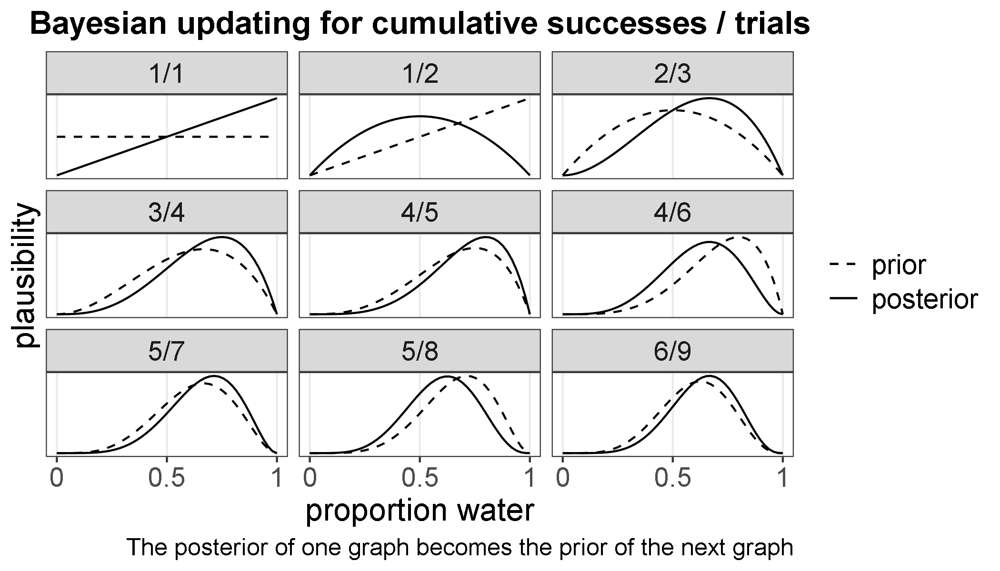
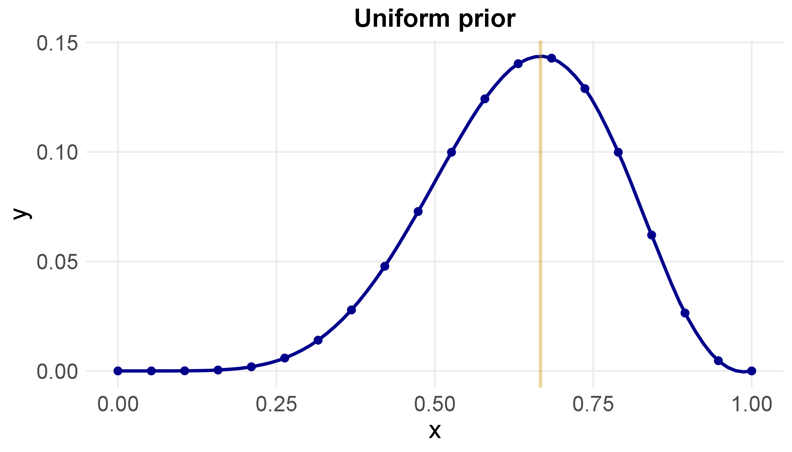
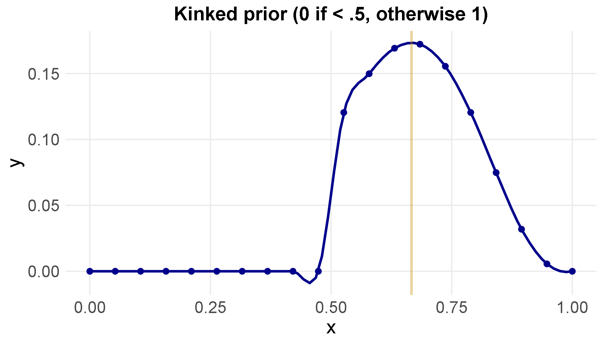
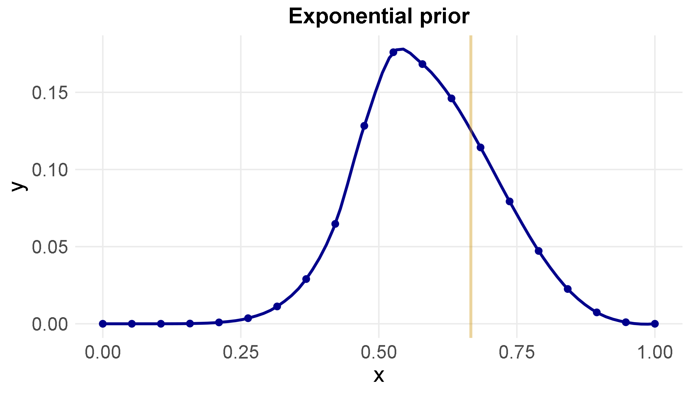

##### prep
```{r global_options, include=F}
knitr::opts_chunk$set(fig.height=5, fig.width=8, echo=F, warning=FALSE, message=FALSE, cache=TRUE, error=T)
```

```{r}
library(tidyverse)
library(strengejacke)
library(sjmisc)
library(psych)
library(palmerpenguins)
library(brms)
library(skimr)
library(knitr)
library(extrafont)
library(showtext)
library(sysfonts)
library(gfonts)
library(xlsx)
library(here)
library(haven)
library(tidybayes)
library(BMA)
library(brms)
library(rethinking)
library(rjags)
library(corrplot)
library(broom)
library(flexmix)
library(remedy)
```

```{r}

options(digits=3, scipen=6)

font_add_google("Source Sans Pro", "sans-serif")

showtext_auto()

use_pkg_gfont("open-sans")

# theme_set(theme_bw() + theme(panel.grid.minor.x=element_blank(),
#                              panel.grid.minor.y=element_blank(),
#                              plot.title=element_text(face="bold",size=16, hjust=.5, family = "Source Sans Pro"),
#                              plot.subtitle = element_text(size=16, family="Source Sans Pro"),
#                              plot.caption=element_text(size=12, family="Source Sans Pro"),
#                              axis.title=element_text(size=16, family="Source Sans Pro"),
#                              axis.text=element_text(size=14, family="Source Sans Pro"),
#                              legend.text=element_text(size=14, family="Source Sans Pro"),
#                              strip.text=element_text(size=14, family="Source Sans Pro")))

theme_set(theme_bw() + theme(panel.grid.minor.x=element_blank(),
                             panel.grid.minor.y=element_blank(),
                             #panel.border = element_blank(),
                             plot.title=element_text(face="bold",size=16, hjust=.5, family = "sans"),
                             plot.subtitle = element_text(size=14, family="sans"),
                             plot.caption=element_text(size=12, family="sans"),
                             axis.title=element_text(size=14, family="sans"),
                             axis.ticks=element_blank(),
                             axis.text=element_text(size=12, family="sans"),
                             legend.text=element_text(size=12, family="sans"),
                             strip.text=element_text(size=12, family="sans")))


nobord <- theme(panel.border=element_blank(),
                axis.ticks=element_blank())


```


The small world is the self-containd logical world of the model. All possibilities are enumerated and there are no surprises. Bayesian models have reasonable claims to optimality: no alternative model could make better use of the information in the data and support better decisions, assuming the small world is an accurate representation of the large world. 

The large world is the reality in which we deploy a generative model. In the large world, there may be events that were not imagind in the small world. The logical consistency of a model in the small world is no guarantee that it is optimal for the large world. Even correctly specified models will generate data that mimics the reality of the large world, but with error. 

### 2.1 The garden of forking data

Bayesian models help us understand what happened, only by correctly specifying everything else that could have happened. As we learn about what did happen, we are left with only those possibilities of what could happen that are consistent with what did happen in the data. 

Suppose there's a bag that contains four marbles that are either blue or white. We don't know the colors of each of the four marbles, but we can enumerate the possibilities. Let white = 0, and blue = 1. 

```{r}
allwhite <- c(0,0,0,0)
allblue <- c(1,1,1,1)
onewhite <- c(0,1,1,1)
twowhite <- c(0,0,1,1)
threewhite <- c(0,0,0,1)
```

```{r}
allwhite <- c("w","w","w","w")
allblue <- c("b","b","b","b")
onewhite <- c("w","b","b","b")
twowhite <- c("w","w","b","b")
threewhite <- c("w","w","w","b")
```

A sequence of three marbles is pulled from the bag. After each draw, the marble is put back in the bag and the bag is shaken (sampling with replacement). The sequence that emerges is `r draw <- c("b","w","b")` `r draw`, in that order.

See the text for details, but there are about as many ways for the draw to be consistent with two or three blue marbles, and many fewer ways for the draw to be consistent with one blue marble. 

```{r remedy001}
## R code 2.1
ways <- c( 0 , 3 , 8 , 9 , 0 )
ways/sum(ways)
```

These plausibilities are also probabilities. In model terms, we have

- the parameter p, which is the proportion of blue marbles. It's what we want to know from the model. 

- the likelihood, or relative number of ways that a candidate parameter could produce the observed data. Another way to think of it is to say, "what is the probability of observing the data that we did, for a given candidate parameter value?"

- the prior plausibility of any candidate parameter value. This comes from previously observed data, theory, a principles guess to start from, etc

- the posterior plausability of any candidate parameter value, produced by inputting the prior probability and likelihoods into Bayes' Theorem or the Bayesian engine more generally

> *Randomization*
> What do we mean when we say a set of data are randomized? It means we have no specific information about the ordering of the data. An ordering about which we know nothing has high information entropy. 


### 2.2 Building a model

We're going to build on the garden of forking data example to build a Bayesian model. 

Suppose you have a globe representing Earth, and you want to know what proportions of the earth are land and water. You decide to toss the globe and record whether your right index fingure lands catches the globe at a point of water or land. You do this nine times and record the following data: 

```{r}
d <- tibble(toss=c("w","l","w","w","w","l","w","l","w"))
d
```

```{r}
frq(d)
```

Six out of nine tosses (67 percent) were water. 

Building a Bayesian model (and in some respects a generative model more generally) involves the following steps: 

- formulate a narrative about how the data might arise (data story)

- educate your model by feeding it the observed data, and seeing what new data it generates (model updating)

- evaluate your model to see how well it is able to generate the data you observed

#### 2.2.1 Data story

The data story behind your model may be descriptive (specifying associations that can be used to predicte outcomes) or causal (a theory of how some events produce other events). Any causal story should also be descriptive, but it's usually unwarranted to interpret any descriptive story causally. 

In the overly simplistic model we currently have, the model goes like this: 

- the true proportion of water covering the globe is p, the parameter we wish to estimate

- a toss of the globe has a probability p of producing water, and 1-p for producing land

- each toss is independent of the other tosses

This story is sufficient to power a probability model that generates data that should mimic the data you've already observed. Ideally, the model of the small world generates data that is similar to the data generating process in the large world. You then use the data generated by the model to make inferences about the data generating process in the real world. 

> *The value of storytelling*
> Many different stories are consistent with your model. Storytelling remains valuable because in trying to develop your story of the data, the researcher may develop additional questions to help revise the model and distinguish it from other models.
 

#### 2.2.2 Bayesian updating

As more data are fed into the model, the model becomes more certain of the solution. As we progress through the sequence of nine trials, notice how the prior and posterior shift in light of the new data. 

```{r}
d <- d %>% 
  mutate(n_trials  = 1:9,
         n_success = cumsum(toss == "w"))
d

sequence_length <- 50

e <- d %>% 
  expand(nesting(n_trials, toss, n_success), 
         p_water = seq(from = 0, to = 1, length.out = sequence_length)) %>% 
  group_by(p_water) %>% 
  mutate(lagged_n_trials  = lag(n_trials, k = 1),
         lagged_n_success = lag(n_success, k = 1)) %>% 
  ungroup() %>% 
  mutate(prior_pre      = ifelse(n_trials == 1, .5,
                             dbinom(x    = lagged_n_success, 
                                    size = lagged_n_trials, 
                                    prob = p_water)),
         likelihood = dbinom(x    = n_success, 
                             size = n_trials, 
                             prob = p_water),
         strip      = paste(n_success, n_trials, sep="/")) %>% 
  # the next three lines allow us to normalize the prior and the likelihood, 
  # putting them both in a probability metric 
  group_by(n_trials) %>% 
  mutate(prior      = prior_pre / sum(prior_pre),
         likelihood = likelihood / sum(likelihood)) 
e   
```

```{r}

```

In graphs 3-5, each new trial hits water so the prior and posterior get closer to each other. For graphs six and eight, the trials do not land on water, so the prior and posterior get a bit further apart relative to their preceding graphs. 

#### 2.2.3 Evaluate the model

Your Bayesian model is the best machinery for learning from the interaction between information and assumptions. And it will give more confident assertions as it is fed more data. Just remember that the model can be both confident and wrong.. the 'truth' of the assertions is conditional on the 'truth' of the model itself. Model performance can be investigated, and different models can be compared against each other. 

### 2.3 Components of the model

Consider what we have counted so far: 

1. The number of ways each conjecture could produce an observation
2. The accumulated number of ways each ocnjecture could produce the entire data
3. The initial plausibility of each conjectured cause of the data

To proceed with the Bayesian model, we need a way to specify how likely each observation is, for a candidate parameter value. For example, if we consider that the earth consists of equal parts land and water (p = .5), how likely was it that we observed six observations of water out of nine tosses? In conventional statistics, a distribution function assigned to an observed variable is called the *likelihood*. 

In R, we assign distributions (densities) through the prefix 'd', as in dnorm, dbinom, etc. 

```{r remedy002}
## R code 2.2
dbinom(6, size=9, prob=0.5 )
```

If the true proportion of water was 50 percent, there was a 16.4 percent probability of observing six observations of water out of nine tosses. In McElreath's wording, taking the likelihood of the data (assigning a distribution to the data according to a candidate parameter value) performed the service of counting the relative number of ways to observe the data that we did, at a given value of a candidate parameter value. 

We construct a posterior distribution of plausibilities by mapping the likelihood of the data, conditional on the prior, across a meaningful range of candidate parameter values. 

### 2.3.3 A model is born

So we have observed variables water (W) and land (L), with some probability p of observing water. The distribution function that we assign to these counts (the likelihood) is the binomial distribution.

$$ W \sim Binomial(N, p) $$

Where N is the total number of tosses (L + W). 

The unobserved parameter p is assumed to be anywhere from zero to a hundred with equal probability. So the likelihood we assign to the proportion of water is a uniform distribution. 

$$ p \sim Uniform(0,1) $$

Consider that we know that there is more water on the surface of the earth than land, so p > .5. This would be incorporating substantive prior information into what is known as an informative prior. But for the moment, we'll assume we know absolutely nothing about the proportion of water, so we need to make any value between zero and one as likely as any other value between zero and one. 

### 2.4 Making the model go

We now use Bayes Theorem to power the model. Bayes Theorem interacts your prior plausibilities with the assigned likelihoods to produce a distribution of posterior plausibilities - the *posterior distribution* contains the relative plausibilities of different parameter values, conditional on the data and model. In this example, we'd notate that as Pr(p|W,L). 

For any candidate parameter value p, the joint distribution of W, L, and p is Pr(W,L,p) = Pr((W,L)|p)Pr(p).

Narratively: the probability of W, L, p can also be expressed as the subset of W, L for some p, scaled by that p's representation in the data. 

To see this explicitly, let's calculate an example of joint, conditional, and marginal probabilities directly.  

```{r}
data(penguins)

penguins <- penguins %>%
  mutate(bill = round(bill_length_mm,-1),
         bill = case_when(bill_length_mm < 40 ~ 40,
                          bill_length_mm > 39.999 & bill_length_mm < 45 ~ 45,
                          bill_length_mm > 44.999 ~ 50))

p <- penguins %>%
  select(species, bill) %>%
  na.omit
head(p)
```

Get the joint probabilities

```{r}
joint <- p %>%
  group_by(species, bill) %>%
  count() %>%
  ungroup() %>%
  mutate(joint=n/sum(n)) %>%
  select(-3) %>%
  pivot_wider(names_from=bill,
              values_from=joint) %>%
  adorn_totals(where=c("row","col")) %>%
  rename(spec_marg = Total) 

joint$species[4] <- "bill_marg"

joint
```

Get conditional frequncies

```{r}
cond <- p %>%
  group_by(species) %>%
  count(bill) %>%
  mutate(cond_freq = n/sum(n)) %>%
  select(-3) %>%
  pivot_wider(names_from=bill,
              values_from=cond_freq)
cond
```

Compare to joint

```{r}
joint
```

Pr(bill, species) = Pr(bill|species)p(species)

Pr(bill=45,species=adelie) = p(|bill=45|species=adelie)p(species=adelie) =`r .318*.442`

```{r}
.318 * .442
```

Which matches the frequency in the joint table. So we get joint frequencies by multiplying a conditional with a marginal frequency. And we get a conditional frequency by dividing a joint by a marginal frequency. 

Having showed that $$ Pr(W,L,p) = Pr((W,L)|p)Pr(p) $$
.. note that definitionally we can simply reorder the terms. So: 

$$ Pr(W,L,p) = Pr(p|W,L)Pr(W,L) $$

And since these statements are definitionally equivalent, we can set them next to each other. 

$$ Pr(p|W,L)(Pr(W,L) = Pr((W,L)|p)Pr(p) $$

And then solve for the parameter p, given the data we observe: 

$$ Pr(p|W,L) = \frac{Pr((W,L)|p)Pr(p)}{Pr(W,L)} $$

And that's Bayes Theorem. 

The terminology here is specific to the example of the proportions of land and water. More generally, we might consider the parameter to be some scientific hypothesis, and data to be the evidence relating to that hypothesis. So Bayes Theorem could then be expressed as: 

$$ Pr(Hypothesis|Evidence) = \frac{Pr(Evidence|Hypothesis)Pr(Hypothesis)}{Pr(Evidence)} $$

The denominator of Bayes Theorem is an integral. Unfortunately, for most analytical problems, the integral has no solution. Instead, there are three common numerical techniques to approximate the integral: 

1. Grid appoximation
2. Quadratic approximation
3. Markov Chain Monte Carolo (MCMC) sampling

We'll start of with grid approximation, in which we use a set of finite values to approximate the infinite number of values that are summed in an integral. For a grid of candidate parameter values, and following Bayes Theorem, we multiply the prior probability of a given candidate value with the likelihood of the candidate value given the observed data. 

Here it is coded up: 

```{r remedy003}
## R code 2.3
# define grid
p_grid <- seq( from=0 , to=1 , length.out=20 )
p_grid
```

These are the candidate parameter values. For each one of these, we compute the prior and likelihood and multiply them. 

```{r}
# define prior
prior <- rep( 1 , 20 )
prior
```

A flat, non-informative prior for each candidate parameter value. 

```{r}
# compute likelihood at each value in grid
likelihood <- dbinom( 6 , size=9 , prob=p_grid )
likelihood 
```

```{r}
# compute product of likelihood and prior
unstd.posterior <- likelihood * prior
unstd.posterior
```

```{r}
# standardize the posterior, so it sums to 1
posterior <- unstd.posterior / sum(unstd.posterior)
posterior
```

Let's plot our posterior distribution. Here's the textbook figure: 

```{r remedy004}
## R code 2.4
plot( p_grid , posterior , type="b" ,
      xlab="probability of water" , ylab="posterior probability" )
mtext( "20 points" )
```

And in ggplot: 
```{r}

```

Now let's look at how choice of prior affects the posterior. 

```{r}
prior <- ifelse(p_grid < .5, 0,1)

# compute likelihood at each value in grid
likelihood <- dbinom( 6 , size=9 , prob=p_grid )

# compute product of likelihood and prior
unstd.posterior <- likelihood * prior

# standardize the posterior, so it sums to 1
posterior <- unstd.posterior / sum(unstd.posterior)
```

```{r}

```

```{r}
prior <- exp( -5*abs( p_grid - 0.5 ) )

# compute likelihood at each value in grid
likelihood <- dbinom( 6 , size=9 , prob=p_grid )

# compute product of likelihood and prior
unstd.posterior <- likelihood * prior

# standardize the posterior, so it sums to 1
posterior <- unstd.posterior / sum(unstd.posterior)
```

```{r}

```

#### 2.4.4 Quadratic Approximation

```{r remedy006}

## R code 2.6
globe.qa <- quap(
  alist(
    W ~ dbinom( W+L ,p) ,  # binomial likelihood
    p ~ dunif(0,1)     # uniform prior
  ) ,
  data=list(W=6,L=3) )

# display summary of quadratic approximation
precis( globe.qa )

```

```{r remedy007}

## R code 2.7
# analytical calculation
W <- 6
L <- 3
curve( dbeta( x , W+1 , L+1 ) , from=0 , to=1 )
# quadratic approximation
curve( dnorm( x , 0.67 , 0.16 ) , lty=2 , add=TRUE )

```

```{r}
n_grid <- 100

d <- tibble(w = c(6,12,24),
            n = c(9,18,36),
            s = c(.16, .11, .08)) %>%
  expand(nesting(w,n,s),
         p_grid=seq(0,1,length_out = n_grid)) %>%
  mutate(prior=1,
         m=.67,
         likelihood=dbinom(w,n,p_grid),
         unstd_grid_post = likelihood*prior,
         unstd_quad_post = dnorm(p_grid, m,s)) %>%
  group_by(w) %>%
  mutate(grid_post = unstd_grid_post / sum(unstd_grid_post),
         quad_post = unstd_quad_post / sum(unstd_quad_post),
         n = str_c("n = ", n),
         n=factor(n, levels=c("n = 9", "n = 18", "n = 36")))

d

```

```{r}

ggplot(d, aes(x=p_grid)) + 
  geom_line(aes(y=grid_post)) + 
  geom_line(aes(y=quad_post), color="darkgrey", alpha=.4) +
  facet_wrap(~n)
  

(6/9) * (1-(6/9))
.67 * .33 / 2
  
```


```{r}
ggplot(data.frame(x=c(0,1)), aes(x=x)) + 
  stat_function(fun=dnorm) + 
  stat_function(fun=dbeta)
```


```{r remedy008}

## R code 2.8
n_samples <- 1000
p <- rep( NA , n_samples )
p[1] <- 0.5
W <- 6
L <- 3
for ( i in 2:n_samples ) {
  p_new <- rnorm( 1 , p[i-1] , 0.1 )
  if ( p_new < 0 ) p_new <- abs( p_new )
  if ( p_new > 1 ) p_new <- 2 - p_new
  q0 <- dbinom( W , W+L , p[i-1] )
  q1 <- dbinom( W , W+L , p_new )
  p[i] <- ifelse( runif(1) < q1/q0 , p_new , p[i-1] )
}

```

```{r remedy009, results='asis'}

## R code 2.9
dens( p , xlim=c(0,1) )
curve( dbeta( x , W+1 , L+1 ) , lty=2 , add=TRUE )


```


### 


