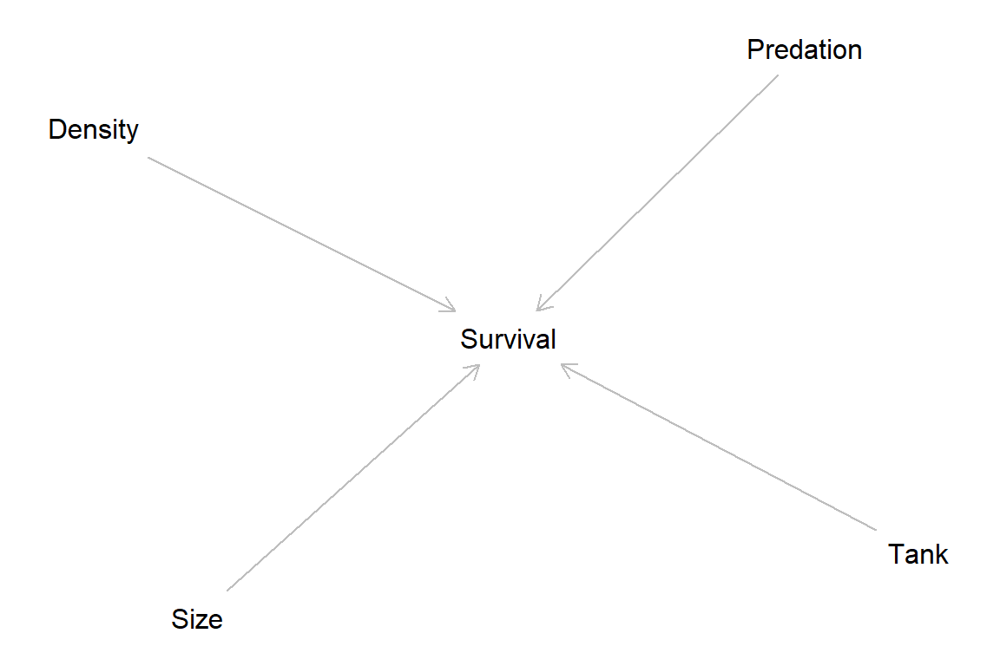

::: {.cell}

```{.r .cell-code}
knitr::opts_chunk$set(autodep=T, fig.height=4, fig.width=6, warning=FALSE, message=FALSE, cache=TRUE, error=T, echo=T)

library(here)
```

::: {.cell-output .cell-output-stderr}
```
here() starts at C:/Users/dan.killian/Documents/StatisticalRethinking
```
:::

```{.r .cell-code}
source(here("scripts/prep.R"))
```

::: {.cell-output .cell-output-stderr}
```
Warning: package 'ggplot2' was built under R version 4.3.1
```
:::

::: {.cell-output .cell-output-stderr}
```
Warning: package 'purrr' was built under R version 4.3.1
```
:::

::: {.cell-output .cell-output-stderr}
```
Warning: package 'dplyr' was built under R version 4.3.1
```
:::

::: {.cell-output .cell-output-stderr}
```
Warning: package 'lubridate' was built under R version 4.3.1
```
:::

::: {.cell-output .cell-output-stderr}
```
── Attaching core tidyverse packages ──────────────────────── tidyverse 2.0.0 ──
✔ dplyr     1.1.3     ✔ readr     2.1.4
✔ forcats   1.0.0     ✔ stringr   1.5.0
✔ ggplot2   3.4.4     ✔ tibble    3.2.1
✔ lubridate 1.9.3     ✔ tidyr     1.3.0
✔ purrr     1.0.2     
```
:::

::: {.cell-output .cell-output-stderr}
```
── Conflicts ────────────────────────────────────────── tidyverse_conflicts() ──
✖ dplyr::filter() masks stats::filter()
✖ dplyr::lag()    masks stats::lag()
ℹ Use the conflicted package (<http://conflicted.r-lib.org/>) to force all conflicts to become errors
# Attaching packages: easystats 0.6.0 (red = needs update)
✔ bayestestR  0.13.1   ✔ correlation 0.8.4 
✖ datawizard  0.9.0    ✔ effectsize  0.8.6 
✖ insight     0.19.6   ✔ modelbased  0.8.6 
✔ performance 0.10.8   ✔ parameters  0.21.3
✖ report      0.5.7    ✖ see         0.8.0 

Restart the R-Session and update packages in red with `easystats::easystats_update()`.


corrplot 0.92 loaded
```
:::

::: {.cell-output .cell-output-stderr}
```
Warning: package 'DescTools' was built under R version 4.3.1
```
:::

::: {.cell-output .cell-output-stderr}
```
Registering fonts with R

Attaching package: 'janitor'

The following object is masked from 'package:insight':

    clean_names

The following objects are masked from 'package:datawizard':

    remove_empty, remove_empty_rows

The following objects are masked from 'package:stats':

    chisq.test, fisher.test


Attaching package: 'reshape2'

The following object is masked from 'package:tidyr':

    smiths
```
:::

::: {.cell-output .cell-output-stderr}
```
Warning: package 'haven' was built under R version 4.3.1
```
:::

::: {.cell-output .cell-output-stderr}
```
Loading required package: lattice
```
:::

::: {.cell-output .cell-output-stderr}
```
Warning: package 'lattice' was built under R version 4.3.2
```
:::

::: {.cell-output .cell-output-stderr}
```
Loading required package: grid
Loading required package: latticeExtra

Attaching package: 'latticeExtra'

The following object is masked from 'package:ggplot2':

    layer

Loading required package: multcomp
```
:::

::: {.cell-output .cell-output-stderr}
```
Warning: package 'multcomp' was built under R version 4.3.1
```
:::

::: {.cell-output .cell-output-stderr}
```
Loading required package: mvtnorm
```
:::

::: {.cell-output .cell-output-stderr}
```
Warning: package 'mvtnorm' was built under R version 4.3.1
```
:::

::: {.cell-output .cell-output-stderr}
```

Attaching package: 'mvtnorm'

The following object is masked from 'package:modelbased':

    standardize

The following object is masked from 'package:effectsize':

    standardize

The following object is masked from 'package:datawizard':

    standardize

Loading required package: survival
```
:::

::: {.cell-output .cell-output-stderr}
```
Warning: package 'survival' was built under R version 4.3.1
```
:::

::: {.cell-output .cell-output-stderr}
```
Loading required package: TH.data
Loading required package: MASS

Attaching package: 'MASS'

The following object is masked from 'package:dplyr':

    select


Attaching package: 'TH.data'

The following object is masked from 'package:MASS':

    geyser

Loading required package: gridExtra

Attaching package: 'gridExtra'

The following object is masked from 'package:dplyr':

    combine


Attaching package: 'HH'

The following object is masked from 'package:DescTools':

    OddsRatio

The following object is masked from 'package:lubridate':

    interval

The following object is masked from 'package:purrr':

    transpose
```
:::

::: {.cell-output .cell-output-stderr}
```
Warning: package 'Hmisc' was built under R version 4.3.1
```
:::

::: {.cell-output .cell-output-stderr}
```

Attaching package: 'Hmisc'

The following objects are masked from 'package:DescTools':

    %nin%, Label, Mean, Quantile

The following objects are masked from 'package:dplyr':

    src, summarize

The following objects are masked from 'package:base':

    format.pval, units


Attaching package: 'plotrix'

The following object is masked from 'package:datawizard':

    rescale


Attaching package: 'scales'

The following object is masked from 'package:plotrix':

    rescale

The following object is masked from 'package:datawizard':

    rescale

The following object is masked from 'package:purrr':

    discard

The following object is masked from 'package:readr':

    col_factor
```
:::

::: {.cell-output .cell-output-stderr}
```
Warning: package 'foreign' was built under R version 4.3.1
```
:::

::: {.cell-output .cell-output-stderr}
```
Loading required package: carData

Attaching package: 'car'

The following objects are masked from 'package:HH':

    logit, vif

The following object is masked from 'package:DescTools':

    Recode

The following object is masked from 'package:dplyr':

    recode

The following object is masked from 'package:purrr':

    some
```
:::

::: {.cell-output .cell-output-stderr}
```
Warning: package 'readxl' was built under R version 4.3.1
```
:::

::: {.cell-output .cell-output-stderr}
```

Attaching package: 'sjmisc'

The following object is masked from 'package:Hmisc':

    %nin%

The following objects are masked from 'package:janitor':

    remove_empty_cols, remove_empty_rows

The following object is masked from 'package:DescTools':

    %nin%

The following objects are masked from 'package:datawizard':

    center, empty_rows, remove_empty_rows, reshape_longer, row_means,
    to_factor, to_numeric

The following object is masked from 'package:purrr':

    is_empty

The following object is masked from 'package:tidyr':

    replace_na

The following object is masked from 'package:tibble':

    add_case
```
:::

::: {.cell-output .cell-output-stderr}
```
Warning: package 'sjPlot' was built under R version 4.3.1
```
:::

::: {.cell-output .cell-output-stderr}
```
#refugeeswelcome
```
:::

::: {.cell-output .cell-output-stderr}
```
Warning: package 'flextable' was built under R version 4.3.1
```
:::

::: {.cell-output .cell-output-stderr}
```

Attaching package: 'flextable'

The following object is masked from 'package:purrr':

    compose


Attaching package: 'sjstats'

The following object is masked from 'package:broom':

    bootstrap

The following object is masked from 'package:parameters':

    p_value

The following objects are masked from 'package:performance':

    icc, r2

The following objects are masked from 'package:effectsize':

    cohens_f, phi

The following objects are masked from 'package:datawizard':

    means_by_group, weighted_mean, weighted_median, weighted_sd


Attaching package: 'sjlabelled'

The following objects are masked from 'package:haven':

    as_factor, read_sas, read_spss, read_stata, write_sas, zap_labels

The following objects are masked from 'package:datawizard':

    to_factor, to_numeric

The following object is masked from 'package:forcats':

    as_factor

The following object is masked from 'package:dplyr':

    as_label

The following object is masked from 'package:ggplot2':

    as_label


Attaching package: 'skimr'

The following object is masked from 'package:sjmisc':

    to_long

The following object is masked from 'package:insight':

    n_unique
```
:::

::: {.cell-output .cell-output-stderr}
```
Warning: package 'labelled' was built under R version 4.3.1
```
:::

::: {.cell-output .cell-output-stderr}
```

Attaching package: 'labelled'

The following objects are masked from 'package:sjlabelled':

    copy_labels, remove_labels, to_character, to_factor, val_labels

The following objects are masked from 'package:sjmisc':

    to_character, to_factor

The following object is masked from 'package:datawizard':

    to_factor

Version:  1.38.6
Date:     2022-04-06
Author:   Philip Leifeld (University of Essex)

Consider submitting praise using the praise or praise_interactive functions.
Please cite the JSS article in your publications -- see citation("texreg").

Attaching package: 'texreg'

The following object is masked from 'package:tidyr':

    extract
```
:::

::: {.cell-output .cell-output-stderr}
```
Warning: package 'psych' was built under R version 4.3.1
```
:::

::: {.cell-output .cell-output-stderr}
```

Attaching package: 'psych'

The following object is masked from 'package:sjstats':

    phi

The following object is masked from 'package:car':

    logit

The following objects are masked from 'package:scales':

    alpha, rescale

The following object is masked from 'package:plotrix':

    rescale

The following object is masked from 'package:Hmisc':

    describe

The following object is masked from 'package:HH':

    logit

The following objects are masked from 'package:DescTools':

    AUC, ICC, SD

The following object is masked from 'package:effectsize':

    phi

The following object is masked from 'package:datawizard':

    rescale

The following objects are masked from 'package:ggplot2':

    %+%, alpha
```
:::

::: {.cell-output .cell-output-stderr}
```
Warning: package 'viridis' was built under R version 4.3.1
```
:::

::: {.cell-output .cell-output-stderr}
```
Loading required package: viridisLite

Attaching package: 'viridis'

The following object is masked from 'package:scales':

    viridis_pal
```
:::

::: {.cell-output .cell-output-stderr}
```
Warning: package 'jtools' was built under R version 4.3.1
```
:::

::: {.cell-output .cell-output-stderr}
```

Attaching package: 'jtools'

The following object is masked from 'package:flextable':

    theme_apa

The following objects are masked from 'package:sjmisc':

    %nin%, center

The following object is masked from 'package:Hmisc':

    %nin%

The following object is masked from 'package:mvtnorm':

    standardize

The following object is masked from 'package:DescTools':

    %nin%

The following object is masked from 'package:modelbased':

    standardize

The following objects are masked from 'package:insight':

    get_data, get_weights

The following object is masked from 'package:effectsize':

    standardize

The following objects are masked from 'package:datawizard':

    center, standardize


Attaching package: 'huxtable'

The following object is masked from 'package:sjlabelled':

    set_label

The following objects are masked from 'package:flextable':

    align, as_flextable, bold, font, height, italic, set_caption,
    valign, width

The following object is masked from 'package:sjPlot':

    font_size

The following objects are masked from 'package:sjmisc':

    add_columns, add_rows, print_html, print_md

The following object is masked from 'package:scales':

    number_format

The following objects are masked from 'package:Hmisc':

    contents, label, label<-

The following objects are masked from 'package:HH':

    odds, position, position<-

The following objects are masked from 'package:parameters':

    print_html, print_md

The following objects are masked from 'package:performance':

    print_html, print_md

The following object is masked from 'package:modelbased':

    print_md

The following objects are masked from 'package:insight':

    print_html, print_md

The following objects are masked from 'package:effectsize':

    print_html, print_md

The following objects are masked from 'package:datawizard':

    print_html, print_md

The following objects are masked from 'package:correlation':

    print_html, print_md

The following objects are masked from 'package:bayestestR':

    print_html, print_md

The following object is masked from 'package:dplyr':

    add_rownames

The following object is masked from 'package:ggplot2':

    theme_grey


Attaching package: 'kableExtra'

The following object is masked from 'package:huxtable':

    add_footnote

The following objects are masked from 'package:flextable':

    as_image, footnote

The following object is masked from 'package:dplyr':

    group_rows
```
:::

::: {.cell-output .cell-output-stderr}
```
Warning: package 'patchwork' was built under R version 4.3.1
```
:::

::: {.cell-output .cell-output-stderr}
```

Attaching package: 'patchwork'

The following object is masked from 'package:MASS':

    area
```
:::

::: {.cell-output .cell-output-stderr}
```
Warning: package 'ggstatsplot' was built under R version 4.3.1
```
:::

::: {.cell-output .cell-output-stderr}
```
You can cite this package as:
     Patil, I. (2021). Visualizations with statistical details: The 'ggstatsplot' approach.
     Journal of Open Source Software, 6(61), 3167, doi:10.21105/joss.03167
```
:::

::: {.cell-output .cell-output-stderr}
```
Warning: package 'ggrepel' was built under R version 4.3.1
```
:::

::: {.cell-output .cell-output-stderr}
```

Attaching package: 'ggpubr'

The following object is masked from 'package:huxtable':

    font

The following objects are masked from 'package:flextable':

    border, font, rotate

The following objects are masked from 'package:datawizard':

    mean_sd, median_mad


Attaching package: 'cowplot'

The following object is masked from 'package:ggpubr':

    get_legend

The following object is masked from 'package:ggthemes':

    theme_map

The following object is masked from 'package:patchwork':

    align_plots

The following objects are masked from 'package:sjPlot':

    plot_grid, save_plot

The following object is masked from 'package:lubridate':

    stamp


Attaching package: 'ggdist'

The following object is masked from 'package:DescTools':

    Mode

The following object is masked from 'package:bayestestR':

    hdi


Attaching package: 'ggridges'

The following objects are masked from 'package:ggdist':

    scale_point_color_continuous, scale_point_color_discrete,
    scale_point_colour_continuous, scale_point_colour_discrete,
    scale_point_fill_continuous, scale_point_fill_discrete,
    scale_point_size_continuous


Attaching package: 'plm'

The following objects are masked from 'package:dplyr':

    between, lag, lead
```
:::

::: {.cell-output .cell-output-stderr}
```
Warning: package 'lme4' was built under R version 4.3.1
```
:::

::: {.cell-output .cell-output-stderr}
```
Loading required package: Matrix
```
:::

::: {.cell-output .cell-output-stderr}
```
Warning: package 'Matrix' was built under R version 4.3.1
```
:::

::: {.cell-output .cell-output-stderr}
```

Attaching package: 'Matrix'

The following objects are masked from 'package:tidyr':

    expand, pack, unpack
```
:::

::: {.cell-output .cell-output-stderr}
```
Warning: package 'rstan' was built under R version 4.3.1
```
:::

::: {.cell-output .cell-output-stderr}
```
Loading required package: StanHeaders
```
:::

::: {.cell-output .cell-output-stderr}
```
Warning: package 'StanHeaders' was built under R version 4.3.1
```
:::

::: {.cell-output .cell-output-stderr}
```

rstan version 2.32.3 (Stan version 2.26.1)

For execution on a local, multicore CPU with excess RAM we recommend calling
options(mc.cores = parallel::detectCores()).
To avoid recompilation of unchanged Stan programs, we recommend calling
rstan_options(auto_write = TRUE)
For within-chain threading using `reduce_sum()` or `map_rect()` Stan functions,
change `threads_per_chain` option:
rstan_options(threads_per_chain = 1)

Do not specify '-march=native' in 'LOCAL_CPPFLAGS' or a Makevars file

Attaching package: 'rstan'

The following object is masked from 'package:psych':

    lookup

The following object is masked from 'package:texreg':

    extract

The following object is masked from 'package:tidyr':

    extract
```
:::

::: {.cell-output .cell-output-stderr}
```
Warning: package 'rstanarm' was built under R version 4.3.1
```
:::

::: {.cell-output .cell-output-stderr}
```
Loading required package: Rcpp
```
:::

::: {.cell-output .cell-output-stderr}
```
Warning: package 'Rcpp' was built under R version 4.3.1
```
:::

::: {.cell-output .cell-output-stderr}
```
This is rstanarm version 2.26.1
- See https://mc-stan.org/rstanarm/articles/priors for changes to default priors!
- Default priors may change, so it's safest to specify priors, even if equivalent to the defaults.
- For execution on a local, multicore CPU with excess RAM we recommend calling
  options(mc.cores = parallel::detectCores())

Attaching package: 'rstanarm'

The following object is masked from 'package:rstan':

    loo

The following object is masked from 'package:psych':

    logit

The following object is masked from 'package:sjstats':

    se

The following object is masked from 'package:car':

    logit

The following object is masked from 'package:HH':

    logit

The following object is masked from 'package:parameters':

    compare_models
```
:::

::: {.cell-output .cell-output-stderr}
```
Warning: package 'brms' was built under R version 4.3.1
```
:::

::: {.cell-output .cell-output-stderr}
```
Loading 'brms' package (version 2.20.4). Useful instructions
can be found by typing help('brms'). A more detailed introduction
to the package is available through vignette('brms_overview').

Attaching package: 'brms'

The following objects are masked from 'package:rstanarm':

    dirichlet, exponential, get_y, lasso, ngrps

The following object is masked from 'package:rstan':

    loo

The following object is masked from 'package:lme4':

    ngrps

The following objects are masked from 'package:ggdist':

    dstudent_t, pstudent_t, qstudent_t, rstudent_t

The following object is masked from 'package:psych':

    cs

The following object is masked from 'package:HH':

    mmc

The following object is masked from 'package:survival':

    kidney

The following object is masked from 'package:stats':

    ar

Loading required package: cmdstanr
This is cmdstanr version 0.5.3
- CmdStanR documentation and vignettes: mc-stan.org/cmdstanr
- CmdStan path: C:/Users/dan.killian/Documents/.cmdstan/cmdstan-2.33.1
- CmdStan version: 2.33.1
Loading required package: parallel
rethinking (Version 2.31)

Attaching package: 'rethinking'

The following objects are masked from 'package:brms':

    LOO, stancode, WAIC

The following objects are masked from 'package:rstanarm':

    logit, se

The following object is masked from 'package:rstan':

    stan

The following object is masked from 'package:jtools':

    standardize

The following objects are masked from 'package:psych':

    logistic, logit, sim

The following objects are masked from 'package:sjstats':

    sd_pop, se, var_pop

The following object is masked from 'package:car':

    logit

The following object is masked from 'package:HH':

    logit

The following object is masked from 'package:mvtnorm':

    standardize

The following objects are masked from 'package:modelbased':

    standardize, unstandardize

The following object is masked from 'package:effectsize':

    standardize

The following objects are masked from 'package:datawizard':

    normalize, standardize, unstandardize

The following object is masked from 'package:purrr':

    map

The following object is masked from 'package:stats':

    rstudent

## Syntax has been updated since v.1.2.0.
## Comments and suggestions -> yiqingxu@stanford.edu.
```
:::

::: {.cell-output .cell-output-stderr}
```
Warning: package 'MatchIt' was built under R version 4.3.1
```
:::

::: {.cell-output .cell-output-stderr}
```

Attaching package: 'did'

The following object is masked from 'package:rethinking':

    sim

The following object is masked from 'package:psych':

    sim

Registered S3 method overwritten by 'hoardr':
  method           from
  print.cache_info httr
ℹ Google's Terms of Service: <https://mapsplatform.google.com>
ℹ Please cite ggmap if you use it! Use `citation("ggmap")` for details.
Attaching package: 'ggmap'

The following object is masked from 'package:cowplot':

    theme_nothing
```
:::

::: {.cell-output .cell-output-stderr}
```
Warning: package 'sf' was built under R version 4.3.1
```
:::

::: {.cell-output .cell-output-stderr}
```
Linking to GEOS 3.11.2, GDAL 3.7.2, PROJ 9.3.0; sf_use_s2() is TRUE
```
:::

::: {.cell-output .cell-output-stderr}
```
Warning: package 'rnaturalearth' was built under R version 4.3.1
```
:::

::: {.cell-output .cell-output-stderr}
```
Support for Spatial objects (`sp`) will be deprecated in {rnaturalearth} and will be removed in a future release of the package. Please use `sf` objects with {rnaturalearth}. For example: `ne_download(returnclass = 'sf')`

Attaching package: 'rnaturalearthdata'

The following object is masked from 'package:rnaturalearth':

    countries110
```
:::

::: {.cell-output .cell-output-stderr}
```
Warning: package 'mapview' was built under R version 4.3.1
```
:::

::: {.cell-output .cell-output-stderr}
```
Warning: package 'spData' was built under R version 4.3.1
```
:::

::: {.cell-output .cell-output-stderr}
```
Warning: package 'tmap' was built under R version 4.3.1
```
:::

::: {.cell-output .cell-output-stderr}
```
Breaking News: tmap 3.x is retiring. Please test v4, e.g. with
remotes::install_github('r-tmap/tmap')
Using the EPSG Dataset v10.019, a product of the International Association of Oil & Gas Producers. 
Please view the terms of use at https://epsg.org/terms-of-use.html.
```
:::

::: {.cell-output .cell-output-stderr}
```
Warning: package 'geodata' was built under R version 4.3.1
```
:::

::: {.cell-output .cell-output-stderr}
```
Loading required package: terra
```
:::

::: {.cell-output .cell-output-stderr}
```
Warning: package 'terra' was built under R version 4.3.1
```
:::

::: {.cell-output .cell-output-stderr}
```
terra 1.7.55

Attaching package: 'terra'

The following object is masked from 'package:ggmap':

    inset

The following objects are masked from 'package:rethinking':

    compare, resample, shade

The following object is masked from 'package:brms':

    autocor

The following object is masked from 'package:rstan':

    extract

The following object is masked from 'package:ggpubr':

    rotate

The following object is masked from 'package:gganimate':

    animate

The following object is masked from 'package:patchwork':

    area

The following objects are masked from 'package:huxtable':

    align, width, wrap

The following objects are masked from 'package:psych':

    describe, distance, rescale

The following object is masked from 'package:texreg':

    extract

The following objects are masked from 'package:flextable':

    align, colorize, rotate, width

The following object is masked from 'package:sjmisc':

    trim

The following object is masked from 'package:scales':

    rescale

The following object is masked from 'package:plotrix':

    rescale

The following objects are masked from 'package:Hmisc':

    describe, mask, zoom

The following object is masked from 'package:MASS':

    area

The following object is masked from 'package:grid':

    depth

The following object is masked from 'package:janitor':

    crosstab

The following object is masked from 'package:datawizard':

    rescale

The following object is masked from 'package:tidyr':

    extract
```
:::

::: {.cell-output .cell-output-stderr}
```
Warning: package 'gt' was built under R version 4.3.1
```
:::

::: {.cell-output .cell-output-stderr}
```

Attaching package: 'gt'

The following object is masked from 'package:huxtable':

    fmt_percent

The following object is masked from 'package:Hmisc':

    html
```
:::

::: {.cell-output .cell-output-stderr}
```
Warning: package 'gtsummary' was built under R version 4.3.1
```
:::

::: {.cell-output .cell-output-stderr}
```

Attaching package: 'gtsummary'

The following object is masked from 'package:huxtable':

    as_flextable

The following objects are masked from 'package:flextable':

    as_flextable, continuous_summary

The following object is masked from 'package:MASS':

    select
```
:::

::: {.cell-output .cell-output-stderr}
```
Warning: package 'gtExtras' was built under R version 4.3.1
```
:::

::: {.cell-output .cell-output-stderr}
```

Attaching package: 'gtExtras'

The following object is masked from 'package:MASS':

    select
```
:::

::: {.cell-output .cell-output-stderr}
```
Warning: package 'officer' was built under R version 4.3.1
```
:::

::: {.cell-output .cell-output-stderr}
```

Attaching package: 'officer'

The following objects are masked from 'package:huxtable':

    to_html, to_rtf

The following object is masked from 'package:readxl':

    read_xlsx
```
:::
:::


# Multilevel tadpoles


::: {.cell hash='rethinking_ch13_cache/html/unnamed-chunk-2_c1bb91634ad2e9ab3b779283adb9b599'}

```{.r .cell-code}
data(reedfrogs)
d <- reedfrogs
rm(reedfrogs)
str(d)
```

::: {.cell-output .cell-output-stdout}
```
'data.frame':	48 obs. of  5 variables:
 $ density : int  10 10 10 10 10 10 10 10 10 10 ...
 $ pred    : Factor w/ 2 levels "no","pred": 1 1 1 1 1 1 1 1 2 2 ...
 $ size    : Factor w/ 2 levels "big","small": 1 1 1 1 2 2 2 2 1 1 ...
 $ surv    : int  9 10 7 10 9 9 10 9 4 9 ...
 $ propsurv: num  0.9 1 0.7 1 0.9 0.9 1 0.9 0.4 0.9 ...
```
:::
:::

::: {.cell hash='rethinking_ch13_cache/html/unnamed-chunk-3_d6131f0573a127dde6b6d3d0234c328e'}

```{.r .cell-code}
head(d)
```

::: {.cell-output-display}

```{=html}
<table class="huxtable" style="border-collapse: collapse; border: 0px; margin-bottom: 2em; margin-top: 2em; ; margin-left: auto; margin-right: auto;  " id="tab:unnamed-chunk-3">
<col><col><col><col><col><tr>
<th style="vertical-align: top; text-align: right; white-space: normal; border-style: solid solid solid solid; border-width: 0.4pt 0pt 0.4pt 0.4pt;    padding: 6pt 6pt 6pt 6pt; font-weight: bold;">density</th><th style="vertical-align: top; text-align: left; white-space: normal; border-style: solid solid solid solid; border-width: 0.4pt 0pt 0.4pt 0pt;    padding: 6pt 6pt 6pt 6pt; font-weight: bold;">pred</th><th style="vertical-align: top; text-align: left; white-space: normal; border-style: solid solid solid solid; border-width: 0.4pt 0pt 0.4pt 0pt;    padding: 6pt 6pt 6pt 6pt; font-weight: bold;">size</th><th style="vertical-align: top; text-align: right; white-space: normal; border-style: solid solid solid solid; border-width: 0.4pt 0pt 0.4pt 0pt;    padding: 6pt 6pt 6pt 6pt; font-weight: bold;">surv</th><th style="vertical-align: top; text-align: right; white-space: normal; border-style: solid solid solid solid; border-width: 0.4pt 0.4pt 0.4pt 0pt;    padding: 6pt 6pt 6pt 6pt; font-weight: bold;">propsurv</th></tr>
<tr>
<td style="vertical-align: top; text-align: right; white-space: normal; border-style: solid solid solid solid; border-width: 0.4pt 0pt 0pt 0.4pt;    padding: 6pt 6pt 6pt 6pt; background-color: rgb(242, 242, 242); font-weight: normal;">10</td><td style="vertical-align: top; text-align: left; white-space: normal; border-style: solid solid solid solid; border-width: 0.4pt 0pt 0pt 0pt;    padding: 6pt 6pt 6pt 6pt; background-color: rgb(242, 242, 242); font-weight: normal;">no</td><td style="vertical-align: top; text-align: left; white-space: normal; border-style: solid solid solid solid; border-width: 0.4pt 0pt 0pt 0pt;    padding: 6pt 6pt 6pt 6pt; background-color: rgb(242, 242, 242); font-weight: normal;">big</td><td style="vertical-align: top; text-align: right; white-space: normal; border-style: solid solid solid solid; border-width: 0.4pt 0pt 0pt 0pt;    padding: 6pt 6pt 6pt 6pt; background-color: rgb(242, 242, 242); font-weight: normal;">9</td><td style="vertical-align: top; text-align: right; white-space: normal; border-style: solid solid solid solid; border-width: 0.4pt 0.4pt 0pt 0pt;    padding: 6pt 6pt 6pt 6pt; background-color: rgb(242, 242, 242); font-weight: normal;">0.9</td></tr>
<tr>
<td style="vertical-align: top; text-align: right; white-space: normal; border-style: solid solid solid solid; border-width: 0pt 0pt 0pt 0.4pt;    padding: 6pt 6pt 6pt 6pt; font-weight: normal;">10</td><td style="vertical-align: top; text-align: left; white-space: normal; border-style: solid solid solid solid; border-width: 0pt 0pt 0pt 0pt;    padding: 6pt 6pt 6pt 6pt; font-weight: normal;">no</td><td style="vertical-align: top; text-align: left; white-space: normal; border-style: solid solid solid solid; border-width: 0pt 0pt 0pt 0pt;    padding: 6pt 6pt 6pt 6pt; font-weight: normal;">big</td><td style="vertical-align: top; text-align: right; white-space: normal; border-style: solid solid solid solid; border-width: 0pt 0pt 0pt 0pt;    padding: 6pt 6pt 6pt 6pt; font-weight: normal;">10</td><td style="vertical-align: top; text-align: right; white-space: normal; border-style: solid solid solid solid; border-width: 0pt 0.4pt 0pt 0pt;    padding: 6pt 6pt 6pt 6pt; font-weight: normal;">1&nbsp;&nbsp;</td></tr>
<tr>
<td style="vertical-align: top; text-align: right; white-space: normal; border-style: solid solid solid solid; border-width: 0pt 0pt 0pt 0.4pt;    padding: 6pt 6pt 6pt 6pt; background-color: rgb(242, 242, 242); font-weight: normal;">10</td><td style="vertical-align: top; text-align: left; white-space: normal; border-style: solid solid solid solid; border-width: 0pt 0pt 0pt 0pt;    padding: 6pt 6pt 6pt 6pt; background-color: rgb(242, 242, 242); font-weight: normal;">no</td><td style="vertical-align: top; text-align: left; white-space: normal; border-style: solid solid solid solid; border-width: 0pt 0pt 0pt 0pt;    padding: 6pt 6pt 6pt 6pt; background-color: rgb(242, 242, 242); font-weight: normal;">big</td><td style="vertical-align: top; text-align: right; white-space: normal; border-style: solid solid solid solid; border-width: 0pt 0pt 0pt 0pt;    padding: 6pt 6pt 6pt 6pt; background-color: rgb(242, 242, 242); font-weight: normal;">7</td><td style="vertical-align: top; text-align: right; white-space: normal; border-style: solid solid solid solid; border-width: 0pt 0.4pt 0pt 0pt;    padding: 6pt 6pt 6pt 6pt; background-color: rgb(242, 242, 242); font-weight: normal;">0.7</td></tr>
<tr>
<td style="vertical-align: top; text-align: right; white-space: normal; border-style: solid solid solid solid; border-width: 0pt 0pt 0pt 0.4pt;    padding: 6pt 6pt 6pt 6pt; font-weight: normal;">10</td><td style="vertical-align: top; text-align: left; white-space: normal; border-style: solid solid solid solid; border-width: 0pt 0pt 0pt 0pt;    padding: 6pt 6pt 6pt 6pt; font-weight: normal;">no</td><td style="vertical-align: top; text-align: left; white-space: normal; border-style: solid solid solid solid; border-width: 0pt 0pt 0pt 0pt;    padding: 6pt 6pt 6pt 6pt; font-weight: normal;">big</td><td style="vertical-align: top; text-align: right; white-space: normal; border-style: solid solid solid solid; border-width: 0pt 0pt 0pt 0pt;    padding: 6pt 6pt 6pt 6pt; font-weight: normal;">10</td><td style="vertical-align: top; text-align: right; white-space: normal; border-style: solid solid solid solid; border-width: 0pt 0.4pt 0pt 0pt;    padding: 6pt 6pt 6pt 6pt; font-weight: normal;">1&nbsp;&nbsp;</td></tr>
<tr>
<td style="vertical-align: top; text-align: right; white-space: normal; border-style: solid solid solid solid; border-width: 0pt 0pt 0pt 0.4pt;    padding: 6pt 6pt 6pt 6pt; background-color: rgb(242, 242, 242); font-weight: normal;">10</td><td style="vertical-align: top; text-align: left; white-space: normal; border-style: solid solid solid solid; border-width: 0pt 0pt 0pt 0pt;    padding: 6pt 6pt 6pt 6pt; background-color: rgb(242, 242, 242); font-weight: normal;">no</td><td style="vertical-align: top; text-align: left; white-space: normal; border-style: solid solid solid solid; border-width: 0pt 0pt 0pt 0pt;    padding: 6pt 6pt 6pt 6pt; background-color: rgb(242, 242, 242); font-weight: normal;">small</td><td style="vertical-align: top; text-align: right; white-space: normal; border-style: solid solid solid solid; border-width: 0pt 0pt 0pt 0pt;    padding: 6pt 6pt 6pt 6pt; background-color: rgb(242, 242, 242); font-weight: normal;">9</td><td style="vertical-align: top; text-align: right; white-space: normal; border-style: solid solid solid solid; border-width: 0pt 0.4pt 0pt 0pt;    padding: 6pt 6pt 6pt 6pt; background-color: rgb(242, 242, 242); font-weight: normal;">0.9</td></tr>
<tr>
<td style="vertical-align: top; text-align: right; white-space: normal; border-style: solid solid solid solid; border-width: 0pt 0pt 0.4pt 0.4pt;    padding: 6pt 6pt 6pt 6pt; font-weight: normal;">10</td><td style="vertical-align: top; text-align: left; white-space: normal; border-style: solid solid solid solid; border-width: 0pt 0pt 0.4pt 0pt;    padding: 6pt 6pt 6pt 6pt; font-weight: normal;">no</td><td style="vertical-align: top; text-align: left; white-space: normal; border-style: solid solid solid solid; border-width: 0pt 0pt 0.4pt 0pt;    padding: 6pt 6pt 6pt 6pt; font-weight: normal;">small</td><td style="vertical-align: top; text-align: right; white-space: normal; border-style: solid solid solid solid; border-width: 0pt 0pt 0.4pt 0pt;    padding: 6pt 6pt 6pt 6pt; font-weight: normal;">9</td><td style="vertical-align: top; text-align: right; white-space: normal; border-style: solid solid solid solid; border-width: 0pt 0.4pt 0.4pt 0pt;    padding: 6pt 6pt 6pt 6pt; font-weight: normal;">0.9</td></tr>
</table>

```

:::
:::


Each row is a tank. We have number of fish in the tank (density), which is independent of the size of the tank (big or small). Some tanks have predators some do not. While density, size, and predation are experimentally manipulated, there may also be unmeasured variation across tanks which is not measured. The outcome is survival.


::: {.cell hash='rethinking_ch13_cache/html/unnamed-chunk-4_2a29e9e5b3cdc9623bf097f446367e36'}

```{.r .cell-code}
lapply(d[,1:3], frq)
```

::: {.cell-output .cell-output-stdout}
```
$density
x <integer> 
# total N=48 valid N=48 mean=23.33 sd=10.38

Value |  N | Raw % | Valid % | Cum. %
-------------------------------------
   10 | 16 | 33.33 |   33.33 |  33.33
   25 | 16 | 33.33 |   33.33 |  66.67
   35 | 16 | 33.33 |   33.33 | 100.00
 <NA> |  0 |  0.00 |    <NA> |   <NA>

$pred
x <categorical> 
# total N=48 valid N=48 mean=1.50 sd=0.51

Value |  N | Raw % | Valid % | Cum. %
-------------------------------------
no    | 24 |    50 |      50 |     50
pred  | 24 |    50 |      50 |    100
<NA>  |  0 |     0 |    <NA> |   <NA>

$size
x <categorical> 
# total N=48 valid N=48 mean=1.50 sd=0.51

Value |  N | Raw % | Valid % | Cum. %
-------------------------------------
big   | 24 |    50 |      50 |     50
small | 24 |    50 |      50 |    100
<NA>  |  0 |     0 |    <NA> |   <NA>
```
:::
:::

::: {.cell hash='rethinking_ch13_cache/html/unnamed-chunk-5_c85c65076c5f2312bc6611f10a89ca22'}

```{.r .cell-code}
table(d$density, d$size)
```

::: {.cell-output .cell-output-stdout}
```
    
     big small
  10   8     8
  25   8     8
  35   8     8
```
:::
:::


The text says that each row is a tank, but also that there are repeated measures on each tank. But I don't see the repeated measures - I see 48 tanks with a single measure of survival.

At any rate, a directed acyclic graph (DAG) of our data could be:


::: {.cell hash='rethinking_ch13_cache/html/unnamed-chunk-6_41dbdf88320425d69b442b3cf0e10f57'}

```{.r .cell-code}
library(dagitty)
library(ggdag)

dat <- dagify(Survival ~ Predation,
              Survival ~ Size,
              Survival ~ Density,
              Survival ~ Tank)
plot(dat)
```

::: {.cell-output-display}
{width=576}
:::
:::


If we assign the same baseline level of survival to all tanks (a single intercept in a regression model), we may miss important variation in baseline levels of survival across tank. The statistical term for this is underfitting the data. If we treat each tank as a separate estimate of baseline survival (an intercept for each tank, or a fixed effects model), we are not allowing the similarities across tanks to contribute the estimate of the overall baseline level of survival. We are at risk of overfitting the data.

We will proceed with the simplest version of a multilevel model, the varying intercepts model.

$S_i \sim Binomial(N_i,p)$

$logit(p_i)=\alpha_{TANK[i]}$

$\alpha_j\sim Normal(0,1.5)$

If survival is modeled as a binomial distribution with probability N and chance of survival p, then we model this with the logistic equation where $p_i$ is the log-odds of survival for each tank. We also have an intercept for each tank, $\alpha_j$, which is adaptively learned from the data.


::: {.cell hash='rethinking_ch13_cache/html/unnamed-chunk-7_2546fe04a15f12fe5ad32223976188a8'}

```{.r .cell-code}
d <- d %>%
  mutate(tank=1:48)

dat <- list(
  S = d$surv,
  N = d$density,
  tank = d$tank
)

m13.1 <- ulam(
  alist(
    S ~ dbinom(N,p),
    logit(p) <- a[tank],
    a[tank] ~ dnorm(0,1.5)
  ),
  data=dat, 
  chains=4, 
  log_lik=T,
  cmdstan = T,
  cores=8,
  iter=2000
)
```

::: {.cell-output .cell-output-stdout}
```
Running MCMC with 4 chains, at most 8 in parallel, with 1 thread(s) per chain...

Chain 1 Iteration:    1 / 2000 [  0%]  (Warmup) 
Chain 1 Iteration:  100 / 2000 [  5%]  (Warmup) 
Chain 1 Iteration:  200 / 2000 [ 10%]  (Warmup) 
Chain 1 Iteration:  300 / 2000 [ 15%]  (Warmup) 
Chain 2 Iteration:    1 / 2000 [  0%]  (Warmup) 
Chain 2 Iteration:  100 / 2000 [  5%]  (Warmup) 
Chain 2 Iteration:  200 / 2000 [ 10%]  (Warmup) 
Chain 2 Iteration:  300 / 2000 [ 15%]  (Warmup) 
Chain 3 Iteration:    1 / 2000 [  0%]  (Warmup) 
Chain 3 Iteration:  100 / 2000 [  5%]  (Warmup) 
Chain 3 Iteration:  200 / 2000 [ 10%]  (Warmup) 
Chain 3 Iteration:  300 / 2000 [ 15%]  (Warmup) 
Chain 4 Iteration:    1 / 2000 [  0%]  (Warmup) 
Chain 4 Iteration:  100 / 2000 [  5%]  (Warmup) 
Chain 4 Iteration:  200 / 2000 [ 10%]  (Warmup) 
Chain 1 Iteration:  400 / 2000 [ 20%]  (Warmup) 
Chain 1 Iteration:  500 / 2000 [ 25%]  (Warmup) 
Chain 1 Iteration:  600 / 2000 [ 30%]  (Warmup) 
Chain 1 Iteration:  700 / 2000 [ 35%]  (Warmup) 
Chain 1 Iteration:  800 / 2000 [ 40%]  (Warmup) 
Chain 1 Iteration:  900 / 2000 [ 45%]  (Warmup) 
Chain 1 Iteration: 1000 / 2000 [ 50%]  (Warmup) 
Chain 1 Iteration: 1001 / 2000 [ 50%]  (Sampling) 
Chain 1 Iteration: 1100 / 2000 [ 55%]  (Sampling) 
Chain 1 Iteration: 1200 / 2000 [ 60%]  (Sampling) 
Chain 2 Iteration:  400 / 2000 [ 20%]  (Warmup) 
Chain 2 Iteration:  500 / 2000 [ 25%]  (Warmup) 
Chain 2 Iteration:  600 / 2000 [ 30%]  (Warmup) 
Chain 2 Iteration:  700 / 2000 [ 35%]  (Warmup) 
Chain 2 Iteration:  800 / 2000 [ 40%]  (Warmup) 
Chain 2 Iteration:  900 / 2000 [ 45%]  (Warmup) 
Chain 2 Iteration: 1000 / 2000 [ 50%]  (Warmup) 
Chain 2 Iteration: 1001 / 2000 [ 50%]  (Sampling) 
Chain 2 Iteration: 1100 / 2000 [ 55%]  (Sampling) 
Chain 2 Iteration: 1200 / 2000 [ 60%]  (Sampling) 
Chain 2 Iteration: 1300 / 2000 [ 65%]  (Sampling) 
Chain 2 Iteration: 1400 / 2000 [ 70%]  (Sampling) 
Chain 3 Iteration:  400 / 2000 [ 20%]  (Warmup) 
Chain 3 Iteration:  500 / 2000 [ 25%]  (Warmup) 
Chain 3 Iteration:  600 / 2000 [ 30%]  (Warmup) 
Chain 3 Iteration:  700 / 2000 [ 35%]  (Warmup) 
Chain 3 Iteration:  800 / 2000 [ 40%]  (Warmup) 
Chain 3 Iteration:  900 / 2000 [ 45%]  (Warmup) 
Chain 3 Iteration: 1000 / 2000 [ 50%]  (Warmup) 
Chain 3 Iteration: 1001 / 2000 [ 50%]  (Sampling) 
Chain 3 Iteration: 1100 / 2000 [ 55%]  (Sampling) 
Chain 3 Iteration: 1200 / 2000 [ 60%]  (Sampling) 
Chain 4 Iteration:  300 / 2000 [ 15%]  (Warmup) 
Chain 4 Iteration:  400 / 2000 [ 20%]  (Warmup) 
Chain 4 Iteration:  500 / 2000 [ 25%]  (Warmup) 
Chain 4 Iteration:  600 / 2000 [ 30%]  (Warmup) 
Chain 4 Iteration:  700 / 2000 [ 35%]  (Warmup) 
Chain 4 Iteration:  800 / 2000 [ 40%]  (Warmup) 
Chain 4 Iteration:  900 / 2000 [ 45%]  (Warmup) 
Chain 4 Iteration: 1000 / 2000 [ 50%]  (Warmup) 
Chain 4 Iteration: 1001 / 2000 [ 50%]  (Sampling) 
Chain 4 Iteration: 1100 / 2000 [ 55%]  (Sampling) 
Chain 4 Iteration: 1200 / 2000 [ 60%]  (Sampling) 
Chain 4 Iteration: 1300 / 2000 [ 65%]  (Sampling) 
Chain 4 Iteration: 1400 / 2000 [ 70%]  (Sampling) 
Chain 1 Iteration: 1300 / 2000 [ 65%]  (Sampling) 
Chain 1 Iteration: 1400 / 2000 [ 70%]  (Sampling) 
Chain 1 Iteration: 1500 / 2000 [ 75%]  (Sampling) 
Chain 1 Iteration: 1600 / 2000 [ 80%]  (Sampling) 
Chain 1 Iteration: 1700 / 2000 [ 85%]  (Sampling) 
Chain 2 Iteration: 1500 / 2000 [ 75%]  (Sampling) 
Chain 2 Iteration: 1600 / 2000 [ 80%]  (Sampling) 
Chain 2 Iteration: 1700 / 2000 [ 85%]  (Sampling) 
Chain 2 Iteration: 1800 / 2000 [ 90%]  (Sampling) 
Chain 3 Iteration: 1300 / 2000 [ 65%]  (Sampling) 
Chain 3 Iteration: 1400 / 2000 [ 70%]  (Sampling) 
Chain 3 Iteration: 1500 / 2000 [ 75%]  (Sampling) 
Chain 3 Iteration: 1600 / 2000 [ 80%]  (Sampling) 
Chain 4 Iteration: 1500 / 2000 [ 75%]  (Sampling) 
Chain 4 Iteration: 1600 / 2000 [ 80%]  (Sampling) 
Chain 4 Iteration: 1700 / 2000 [ 85%]  (Sampling) 
Chain 4 Iteration: 1800 / 2000 [ 90%]  (Sampling) 
Chain 1 Iteration: 1800 / 2000 [ 90%]  (Sampling) 
Chain 1 Iteration: 1900 / 2000 [ 95%]  (Sampling) 
Chain 1 Iteration: 2000 / 2000 [100%]  (Sampling) 
Chain 2 Iteration: 1900 / 2000 [ 95%]  (Sampling) 
Chain 2 Iteration: 2000 / 2000 [100%]  (Sampling) 
Chain 3 Iteration: 1700 / 2000 [ 85%]  (Sampling) 
Chain 3 Iteration: 1800 / 2000 [ 90%]  (Sampling) 
Chain 3 Iteration: 1900 / 2000 [ 95%]  (Sampling) 
Chain 3 Iteration: 2000 / 2000 [100%]  (Sampling) 
Chain 4 Iteration: 1900 / 2000 [ 95%]  (Sampling) 
Chain 4 Iteration: 2000 / 2000 [100%]  (Sampling) 
Chain 1 finished in 0.7 seconds.
Chain 2 finished in 0.6 seconds.
Chain 3 finished in 0.6 seconds.
Chain 4 finished in 0.6 seconds.

All 4 chains finished successfully.
Mean chain execution time: 0.6 seconds.
Total execution time: 0.8 seconds.
```
:::
:::

::: {.cell hash='rethinking_ch13_cache/html/unnamed-chunk-8_7384ba204ae5272dfa031bf107ed052c'}

```{.r .cell-code}
precis(m13.1, depth=2)
```

::: {.cell-output .cell-output-error}
```
Error in seq_len(ncol(x)): argument must be coercible to non-negative integer
```
:::
:::

::: {.cell hash='rethinking_ch13_cache/html/unnamed-chunk-9_e6e90b024b2c55e5b735afa348ebc647'}

```{.r .cell-code}
b1 <- brm(surv ~ 1|tank,
          family="binomial",
          data=d,
          backend="cmdstanr",
          chains=4,
          iter=2000,
          cores=8)
```

::: {.cell-output .cell-output-error}
```
Error: Specifying 'trials' is required for this model.
```
:::
:::

::: {.cell hash='rethinking_ch13_cache/html/unnamed-chunk-10_1f7f3427845c5bfaef808dfc72459bb8'}

```{.r .cell-code}
summary(b1)
```

::: {.cell-output .cell-output-error}
```
Error in h(simpleError(msg, call)): error in evaluating the argument 'object' in selecting a method for function 'summary': object 'b1' not found
```
:::

```{.r .cell-code}
ranef(b1)
```

::: {.cell-output .cell-output-error}
```
Error in eval(expr, envir, enclos): object 'b1' not found
```
:::
:::
